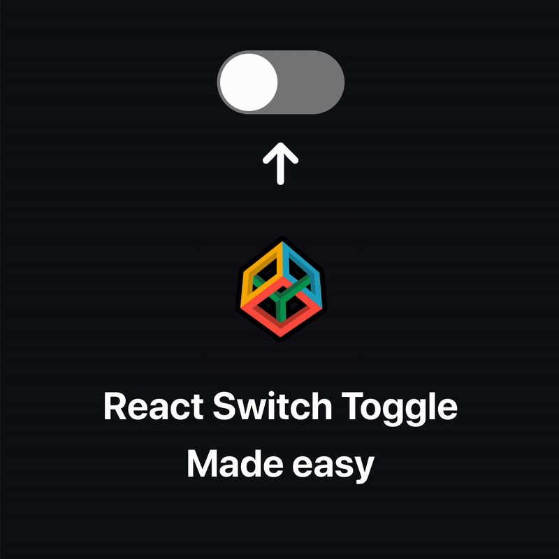
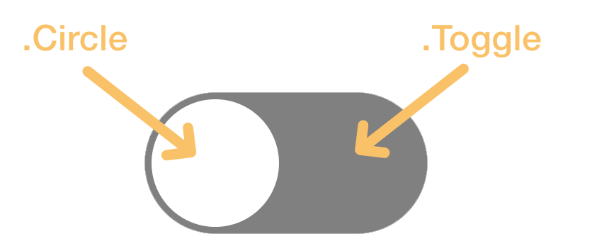

# React Toggle Switch

<p align="center"></p>

### Toggle component

The `input` tag is outside the label, we can connect the two by giving the input and `id`
and giving the label an `htmlFor='input_id'` attribute. This is done so the CSS selector
can be applied easier ([Adjacent sibling combinator](https://developer.mozilla.org/en-US/docs/Web/CSS/Adjacent_sibling_combinator))

```jsx
function Toggle() {
  return (
    <>
      <input className={style.CheckBox} type='checkbox' id='switch'/>

      <label className={style.Toggle} htmlFor='switch'>
        <span className={style.Circle}/>
      </label>
    </>
  );
}
```

### CSS styles

We hide the regular HTML check box

<p align="center"></p>

```css
.CheckBox {
  height: 0;
  width: 0;
  visibility: hidden;
}
```

We make the initial `.Toggle` background into grey and the radius equal to the width. We
add a background transition, which will automatically animate the background to grey from whatever
color it was.

<p align="center"></p>

```css
.Toggle {
  position: relative;
  display: flex;
  align-items: center;

  cursor: pointer;

  width: 200px;
  height: 100px;
  border-radius: 200px;

  background-color: grey;
  transition: background-color 0.2s;
}
```

Now we target the cirlce inside the `.Toggle` class. To make a circle make sure the `width`,
`height` and `radius` are all equal.

Give it an offset of `5px` from the top and left. The `transition` will make sure to animate
back to `top: 5px` and `left: 5px` from whatever previous position the `.Circle` was.

```css
/* (1) */
.Toggle .Circle {
  content: "";
  position: absolute;
  
  top: 5px;
  left: 5px;
  transition: 0.2s;

  /* This makes the span circular */
  width: 90px;
  height: 90px;
  border-radius: 90px;
  
  background: white;
}
```

And now we get to the actual toggle trigger. The circle starts with the position of `left: 5px` from
the style above (1). Then below we tell css to change that position to `5px` from the right,
but only when the `.CheckBox` has been checked. (The `+` selector here means select the `.Toggle .Circle` class) that is right after a `.CheckBox` element. ([more info on + here](https://developer.mozilla.org/en-US/docs/Web/CSS/Adjacent_sibling_combinator))

```css
/* (2) */
.CheckBox:checked + .Toggle .Circle {
  left: calc(100% - 5px);
  transform: translateX(-100%);
}

.CheckBox:checked + .Toggle {
  background-color: rgb(22, 206, 92);
}
```

We do the same thing but for the background color of the `.Toggle`.

---

# How to install

Clone the repo
```shell
git clone <URL>
```

Cd into the cloned folder and install dependencies
```shell
cd <FOLDER>
npm install
```

Run React, this should open a page in your browser
```shell
npm run start
```

**Note:** if you don't have `nodejs` installed go to [this link](https://nodejs.org/en/download/)